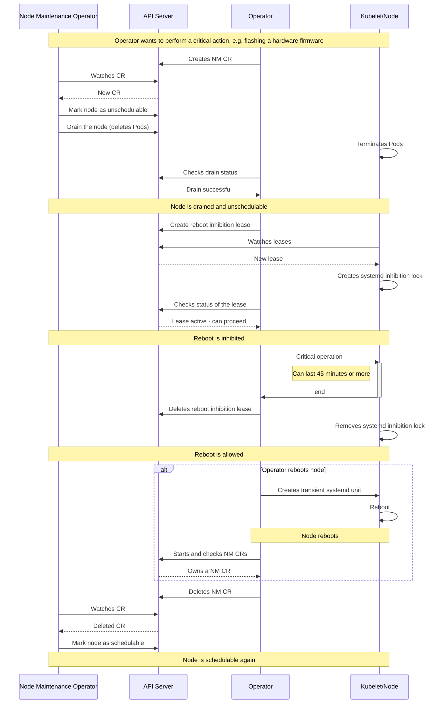

```mermaid
sequenceDiagram

participant NMO as Node Maintenance Operator
participant API as API Server
participant Operator
participant node as Kubelet/Node

note over NMO,node: Operator wants to perform a critical action, e.g. flashing a hardware firmware

Operator ->> API: Creates NM CR
NMO ->> API: Watches CR
API -->> NMO: New CR
NMO ->> API: Mark node as unschedulable
NMO ->> API: Drain the node (deletes Pods)
node ->> node: Terminates Pods
Operator ->> API: Checks drain status
API -->> Operator: Drain successful


note over NMO,node: Node is drained and unschedulable

Operator ->> API: Create reboot inhibition lease
node ->> API: Watches leases
API -->> node: New lease
node ->> node: Creates systemd inhibition lock
Operator ->> API: Checks status of the lease
API -->> Operator: Lease active - can proceed


note over NMO,node: Reboot is inhibited

Operator ->> node: Critical operation
activate node
note left of node: Can last 45 minutes or more
node ->> Operator: end
deactivate node

Operator ->> API: Deletes reboot inhibition lease
node ->> node: Removes systemd inhibition lock


note over NMO,node: Reboot is allowed

alt Operator reboots node
  Operator ->> node: Creates transient systemd unit
  node ->> node: Reboot
  note over Operator, node: Node reboots
  Operator ->> API: Starts and checks NM CRs
  API -->> Operator: Owns a NM CR
end

Operator ->> API: Deletes NM CR
NMO ->> API: Watches CR
API -->> NMO: Deleted CR
NMO ->> API: Mark node as schedulable


note over NMO,node: Node is schedulable again

```
